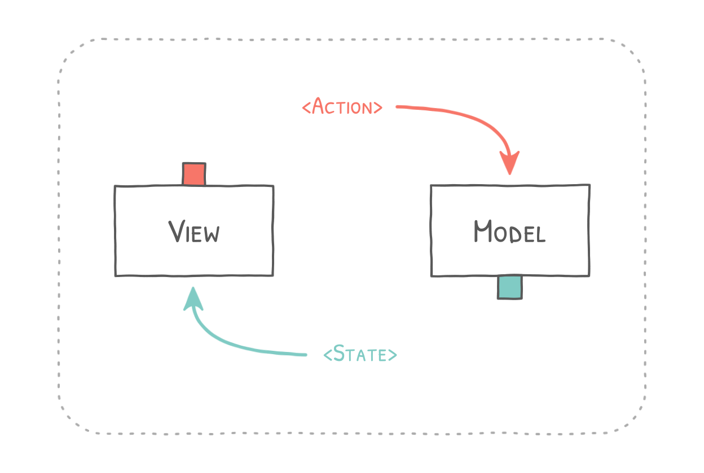

# rx-mvi

[](https://jitpack.io/#cc.femto/rx-mvi)

Proposal for reactive UI applications inspired by Model View Intent written in Kotlin.

A UI component consists of a `View` and a `Model`. The `View` is responsible for
rendering state and forwarding user input to the `Model`. The `Model` is
processing user input and external state to produce a `State` stream, which
is in turn rendered by the `View`.

The proposed pattern embraces the concept of unidirectional data flow and makes
heavy use of [Reactive Streams](http://reactivex.io/).
The resulting UI components are fractal and can be nested to form larger components.

It is inspired by concepts like
[Cycle.js](https://cycle.js.org/),
[Redux](https://redux.js.org/), and
[this article by André Staltz](https://staltz.com/unidirectional-user-interface-architectures.html).




## Binaries
```gradle
dependencies {
    implementation "cc.femto:rx-mvi:4.0.1"
}
```

Requires the JitPack repository:
```gradle
repositories {
    maven { url "https://jitpack.io" }
}
```
